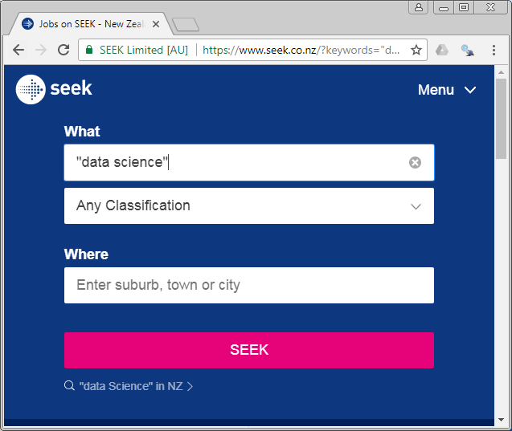
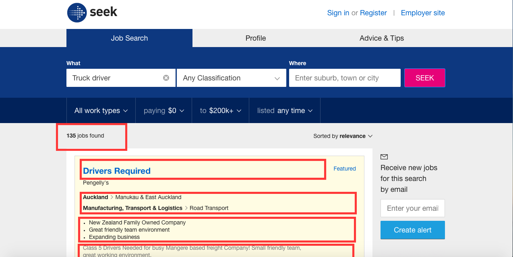
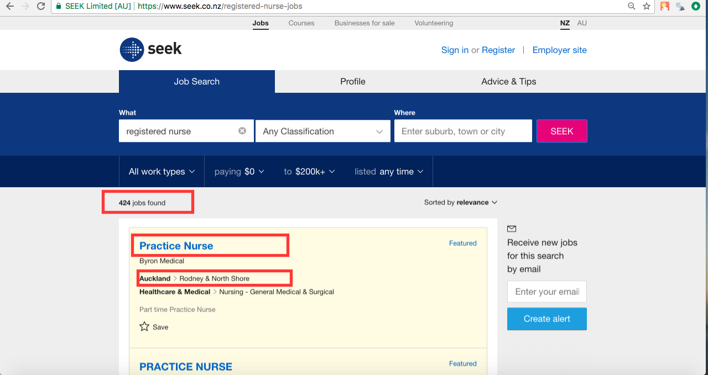
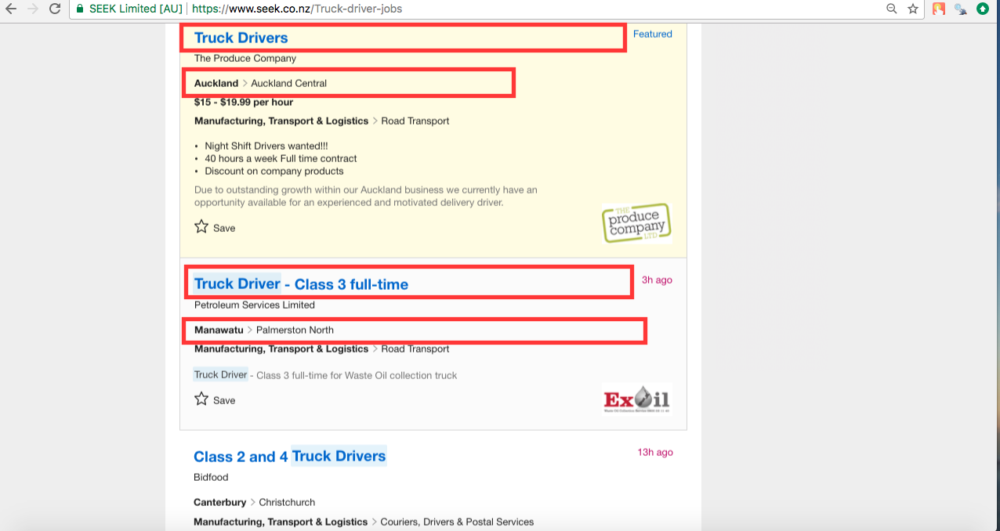
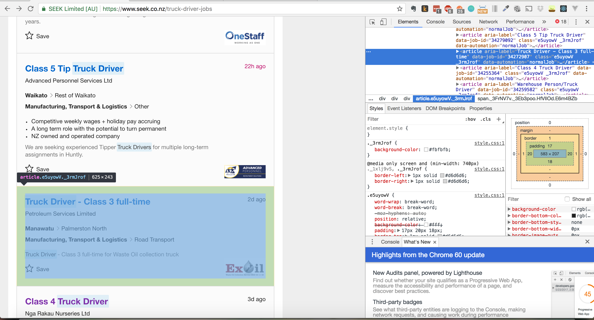
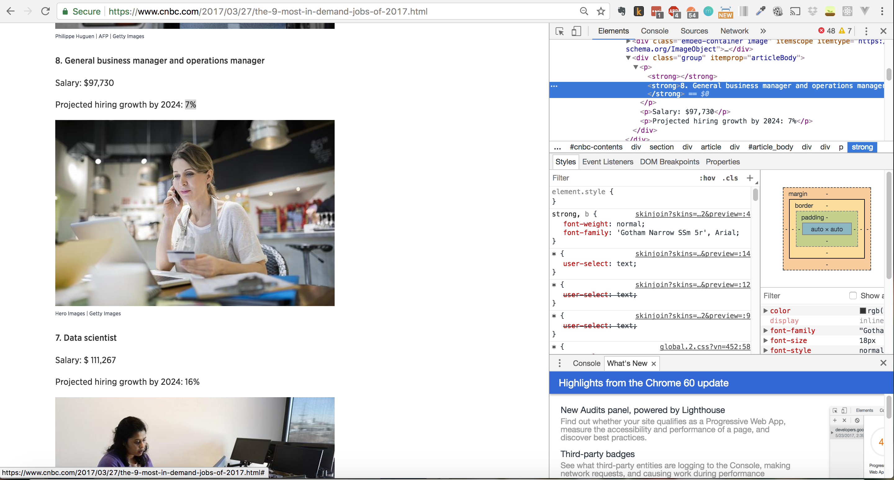
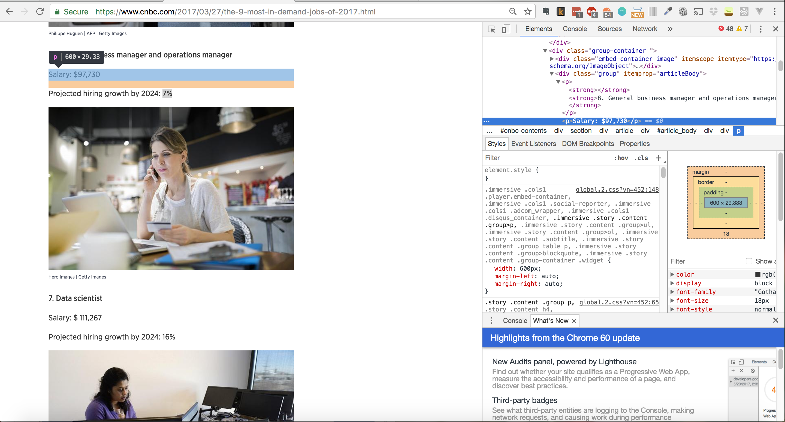

```{r setup, include=FALSE}
knitr::opts_chunk$set(echo = TRUE)
```
<span style="color: #ce2227">
**_If you have worked on this assignment in groups, then only a single submission is required from the group, but you should make a note of collaborators at the start of the document_**
</span>

# Group Members
- Ayesha Wan Ismail
- Bhavisha Solanki
- Ruth Banda

# Problem Definition

Finding the top 9 most in-demand careers of 2017 and the salary that you receive from working under one of those job category. We will then compare it to see when typed into Seek to search for jobs in New Zealand of those 9 categories how many jobs of them are available in our country and in what city/area. This is for us to compare if the careers are more in demand because it is a low pay job or if it because the country lacks that set of skills and knowledge level or it could just be a mixture of both. Also for the next generation to take into account in deciding careers and what job paths they want to take. So they can understand what jobs are in demand and what is the strong growing field also to know what lacks skills and to work towards gaining more skills and experience for jobs rather than sticking to low pay jobs however that can be a starting point for them when entering into the industry and earning in their initial years and from their can move up and into higher positions.

To answer this question, we could follow this manual process:


  1. Visit the [CNBC] website and go to a blog article "[The 9 most-in-demand jobs of 2017]". 
  2. Underneath the main title, within sub-headings, we would see a list of jobs in-demand, their current salary and the projected hiring growth of that job by 2024:
    a. Identify the 9 jobs in demand (e.g. Registered Nurse, Data Scientist) and projected hiring growth by 2024.
    b. Populate it into a table.
    c. Add the identified location information to our list of results
 
  3. Visit the [Seek] website and go search below specific jobs and where they are available in New Zealand. 
  4. Underneath the main title, within sub-headings, we would see the space to type in our specified job and click the seek button to see where it is available in the country and how many of that job is available (e.g 50 jobs or 200)
    a. Identify the jobs list (e.g. Truck Drivers, Registered Nurses) headings and city that requires it as well as show the total number of jobs found at the top when searched.
    b. Populate it into a vector.
    c. Add the identified location information to our list of results
    
  
## Required Components
On the "[Seek]" page, under the hob search heading you can search for a particular job and where it is placed:



As we scroll down, we are able to identify different headings and sub headings and a search button, like below:



In the next section, we are going to scrape the information below on the seek page after we have clicked the seek button. To do so, we must know how the page structures its documents and what hints can we extract from it to make it easier to identify the pages that we need. Also, we want to extract the number of jobs found  section, so we also have to find the correct CSS selectors. It is very important to use the top left hand corner highlighted showing the number of jobs found so we know how many the country has or lacks of that specific job category and skills related to that. The reason also why they may not take it which may be due to salary which the next website we scrape will compare.





As we try to find the CSS selector for the number of jobs found for the particular jobs searched, we have to figure out how to exclude the paragraphs in CSS sections so that we scrape for number of jobs element under each job heading which is related to the next webpage we will scrape which is the 9 most in demand jobs, it would not get all of the irrelevant paragraphs (p) selectors.




We want to take the job heading and the location it is at the other details are not necessary just the job title and where in the country it is located so can be used to make our graphs. 


We are using Chrome Developer tools to get the XPath of the number of jobs available for the specific job searched in the seek section in the website. We do this to get the raw data to plot the number of jobs in each category to what that jobs salary provides and the location of the job in the country (e.g south island or north island). This data will aid us in plotting our graphs and to find trends within jobs (y-axis: jobs category and the number available, x-axis: salary of each of the 9 job categories (we get this data fromt he next website we extract)). 



So the XPath identified is this one: 
`//*[@id="app"]/div/div/div[1]/div/div[2]/span/div/section/div/div/div[2]/div/div[2]/div/div[1]/article[5]`

For other job titles, this require us to follow the same procedure, just with different links for the search results. 


 On the "[The 9 Most In-Demand Jobs of 2017]" article, the page contains a list of jobs:

   
    
We know that the required URL to get the components from is [CNBC] article, and as we scroll down, we are able to identify the job titles headings and sub headings. In this section, we are going to scrape the job titles and salary title to compare with the seek website. To do so, we must know how the page structures its documents and what hints can we extract from it to make it easier to identify the pages that we need. Also, we want to extract the 'Salary' section and the "Job title section" with its given rank, so we also have to find the correct CSS selectors like below:

    


 code image for 2nd website (with the code) change description below
 
As we try to find the CSS selector for the '9 most in demand careers' section, we have to figure out how to exclude the paragraphs in CSS sections so that we scrape for projected growth, it would not get all of the irrelevant paragraphs (p) selectors.




This is the CSS selector identified for the job title: 
`#article_body > div:nth-child(2) > div.group > p:nth-child(1) > strong:nth-child(2)`


This is the CSS selector identified for the salary:



This is the CSS selector identified for the Projected hiring growth:

`#article_body > div:nth-child(2) > div.group > p:nth-child(3)`


We want to take the 9 careers which are mentioned and the salary of each job which is an estomate of how much each individual earns doing those top 9 most in demand careers. This will show us if there is a relatonship between salary and most in demand careers such as they are in demand as they are a low pay or there is a lack of skills and knowledge around that area in our country. The data is only reliable to New Zealand as we are using a NZ job site therefore is limited to one country which means will be more reliable but can not be assumed for multiple countries and populations.


# Scraping Procedure
We start with defining a few key components (the required libraries, starting url, and key XPath/CSS selectors):

```{r get job titles, echo=TRUE}
library(rvest)
library(ggplot2)

##CREDIT for initial code: Grant Dick (Lecturer)

url <-
"https://www.cnbc.com/2017/03/27/the-9-most-in-demand-jobs-of-2017.html"
page <- read_html(url)

job.selector <- "div.group"
jobs <- html_nodes(page, job.selector)

title.selector <- "p > strong"
titles <- html_nodes(jobs, title.selector)
titles <- html_text(titles, trim = TRUE)


titles <- titles[nchar(titles) > 0]
job.details <-
do.call(rbind, strsplit(titles, ". ", fixed = TRUE))

job.details
```

However for the second part and the third part for this website, we have to exclude other paragraphs. Hence, we have to extract the relevant page elements using XPath because the CSS selectors are giving us all of the <p> elements, and add them into a results list (steps 2 a, b, and c in our previously defined workflow). :

```{r salaries, echo=TRUE}
##CREDIT for initial code: Grant Dick (Lecturer)

salary.selector <- "//p[contains(text(), 'Salary: ')]"
salaries <- html_nodes(jobs, xpath = salary.selector)
salaries <- html_text(salaries, trim = TRUE)

# salaries <- strsplit(salaries, "5. Information security analyst", fixed = TRUE)
salaries <- gsub("5. Information security analyst", "", salaries)
salaries <- gsub("\n", "", salaries)

salaries

```


Next, we are going to extract the Projected hiring growth by 2024. We use XPath to get the information:
```{r projected growth rate, echo=TRUE}

growth.selector <- "//p[contains(text(), '%')]"

hiring.growths <- html_nodes(jobs, xpath=growth.selector)
hiring.growths <- html_text(hiring.growths)


pattern <- "Projected hiring growth by 2024: "
clean <- gsub(pattern, "", hiring.growths)
hiring.growths <- gsub("%", "", clean)
hiring.growths <- as.numeric(hiring.growths)
hiring.growths

# pattern <- "Projected hiring growth by 2024: "
# clean <- gsub(pattern, "", hiring.growths)
# clean2 <- gsub("%", "", clean)
# clean2

```

Next, we are going to get just the ranks of the job titles, excluding the job titles itself. 
```{r attempt to get ranks, echo=TRUE}
get.ranks <- job.details[,1]
get.ranks <- as.numeric(get.ranks)
get.ranks
```

```{r make into a vector first, echo=TRUE}
vec <- table(hiring.growths, get.ranks)
vec
barplot(vec)
```


```{r cnbc matrix, echo=TRUE}
cnbc<- matrix(cbind(job.details,salaries,hiring.growths), nrow = 9, ncol = 4)
cnbc
```


```{r new DF, echo=TRUE}
#cnbc<- matrix(cbind(job.details,salaries,hiring.growths, nrow = 9, ncol = 3))
df <-data.frame(cnbc)
df <- cnbc[, c(2,4)]
df
```

```{r test barplot, echo=TRUE}

```

```{r ggplot, echo=TRUE}
#ggplot(df, aes(df))
#plot(c(cnbc))
#x<-salaries
#y<-hiring.growths
#plot(x,y,xlab="x", ylab="y",pch=19)

```


```{r plot growth rate, echo=TRUE}
#plot(hiring.growths,job.details, main="Scatterplot",
# xlab ="hiring.growths" , ylab="job.details", #pch=19)

```


```{r search results for truck driver jobs, echo=TRUE}
url <-
"https://www.seek.co.nz/truck-driver-jobs"
page <- read_html(url)


search.selector <- "#SearchSummary > strong"
truck.drivers <- html_nodes(page, search.selector)
truck.drivers <- html_text(truck.drivers)

truck.drivers
```

```{r find the salary for truck driver, echo=TRUE}

url <- "https://www.seek.co.nz/truck-driver-jobs?page=3&salaryrange=40000-999999&salarytype=annual#"
page <- read_html(url)


search.selector <- "#SearchSummary > strong"
truck.drivers <- html_nodes(page, search.selector)
truck.drivers <- html_text(truck.drivers)

truck.drivers

search.selector <- "//article[4]/div[1]/span[3]" #XPath selector
get.salary <- html_nodes(page, xpath=search.selector)
get.salary <- html_text(get.salary)

get.salary

```


```{r search results for General business manager and operations manager, echo=TRUE}
url <-
"https://www.seek.co.nz/General-business-manager-and-operations-manager-jobs?classification=7019%2C6251%2C1203%2C6076%2C6317%2C6043%2C6362&subclassification=6256%2C6253%2C6259%2C6082%2C6081%2C6080%2C6047%2C6046%2C6045%2C6044%2C6365%2C6366%2C6363%2C6254"
page <- read_html(url)


search.selector <- "#SearchSummary > strong"
managers <- html_nodes(page, search.selector)
managers <- html_text(managers)

managers
```


```{r search results for Data Scientist, echo=TRUE}
url <-
"https://www.seek.co.nz/Data-scientist-jobs"
page <- read_html(url)


search.selector <- "#SearchSummary > strong"
data.scientists <- html_nodes(page, search.selector)
data.scientists <- html_text(data.scientists)

data.scientists
```

```{r search results for Registered Nurse, echo=TRUE}
url <-
"https://www.seek.co.nz/Registered-Nurse-jobs"
page <- read_html(url)


search.selector <- "#SearchSummary > strong"
registered.nurse <- html_nodes(page, search.selector)
registered.nurse <- html_text(registered.nurse)

registered.nurse
```


```{r search results for Information Security Analyst, echo=TRUE}
url <-
"https://www.seek.co.nz/Information-security-analyst-jobs"
page <- read_html(url)


search.selector <- "#SearchSummary > strong"
info.security.analyst <- html_nodes(page, search.selector)
info.security.analyst <- html_text(info.security.analyst)

info.security.analyst
```

```{r search results for software engineer, echo=TRUE}
url <-
"https://www.seek.co.nz/Software-Engineer-jobs"
page <- read_html(url)


search.selector <- "#SearchSummary > strong"
software.engineers <- html_nodes(page, search.selector)
software.engineers <- html_text(software.engineers)

software.engineers
```

```{r search results for Financial Advisor, echo=TRUE}
url <-
"https://www.seek.co.nz/Financial-Advisor-jobs"
page <- read_html(url)


search.selector <- "#SearchSummary > strong"
financial.advisor <- html_nodes(page, search.selector)
financial.advisor <- html_text(financial.advisor)

financial.advisor
```


```{r search results for physical therapist, echo=TRUE}
url <-
"https://www.seek.co.nz/Physical-therapist-jobs"
page <- read_html(url)


search.selector <- "#SearchSummary > strong"
physical.therapist <- html_nodes(page, search.selector)
physical.therapist <- html_text(physical.therapist)

physical.therapist


#HOWEVER, if we go for Physiotherapist title on the Seek search website, we will get results. Observation, different titles in some countries may result in minor confusion when doing web scraping

url <-
"https://www.seek.co.nz/Physiotherapist-jobs"
page <- read_html(url)


search.selector <- "#SearchSummary > strong"
physiotherapist <- html_nodes(page, search.selector)
physiotherapist <- html_text(physiotherapist)

physiotherapist

```

```{r search results for home health aide jobs, echo=TRUE}
url <-
"https://www.seek.co.nz/Home-Health-Aide-jobs"
page <- read_html(url)


search.selector <- "#SearchSummary > strong"
home.health.aide <- html_nodes(page, search.selector)
home.health.aide <- html_text(home.health.aide)

home.health.aide
```


```{r get salary for jobs on, echo=TRUE}
url <- "https://www.seek.co.nz/truck-driver-jobs?page=3&salaryrange=40000-999999&salarytype=annual#"
page <- read_html(url)
salary.selector <-"//*[@id='app']/div/div/div[1]/div/div[2]/span/div/section/div/div/div[2]/div/div[2]/div/div[1]/article[6]/div[1]"
#seek<- html_nodes(salary, xpath = seek.selector)

title.salary.selector <- "#app > div > div > div:nth-child(3) > div > div._1qkS_Nq._3sqzogv._1XnlU0N > span > div > section > div > div > div._3stY0dI > div > div:nth-child(2) > div > div._365Hwu1._14yeqbb > article:nth-child(4) > div._1mzsMx5 > span:nth-child(3)"
```


# Analysis
Our `job.locations` vector is now complete, and should contain an entry for every job advertised. Now, we can create a tally of these locations and plot them using a suitable method (e.g., a bar plot):
```{r summary, echo=TRUE, fig.align="center", out.width="100%"}

# tally <- table(job.locations)
# barplot(tally, main="Location of Data Science Jobs on Seek", ylab="# Jobs Found", col="#00508f")

```

[CNBC]: https://www.cnbc.com/2017/03/27/the-9-most-in-demand-jobs-of-2017.html
[Seek]: https://seek.co.nz
[query results]: https://www.seek.co.nz/jobs?keywords=%22data+science%22

