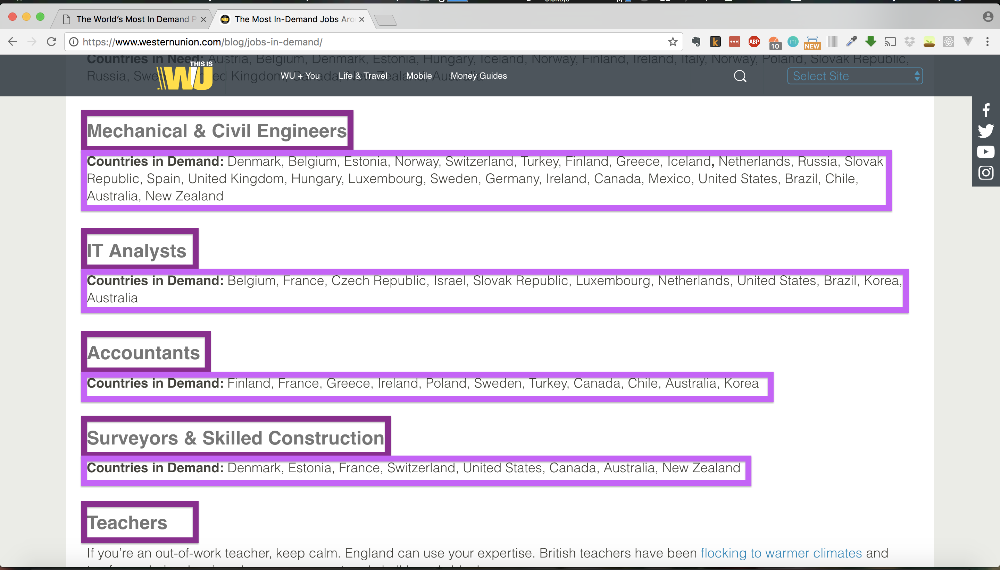
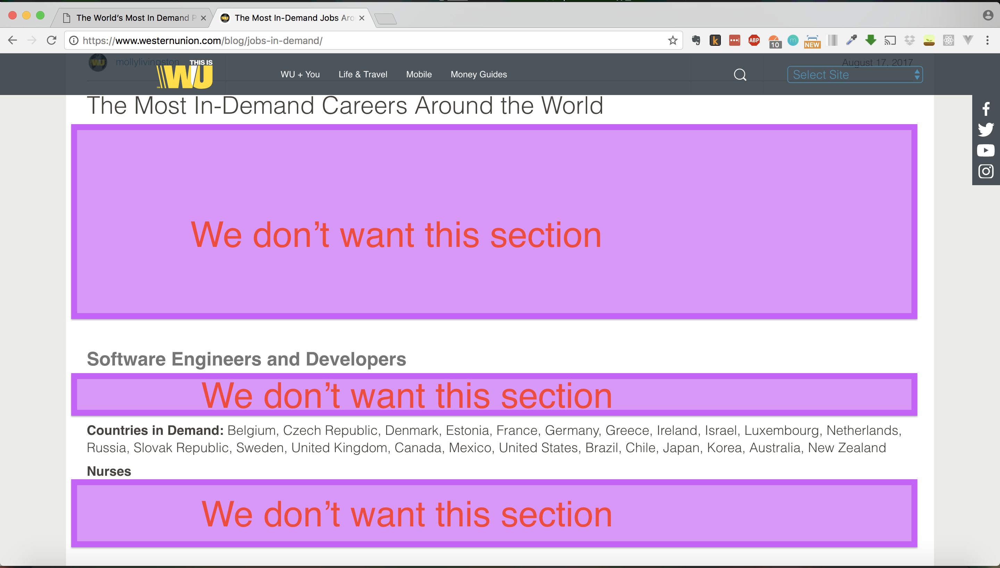
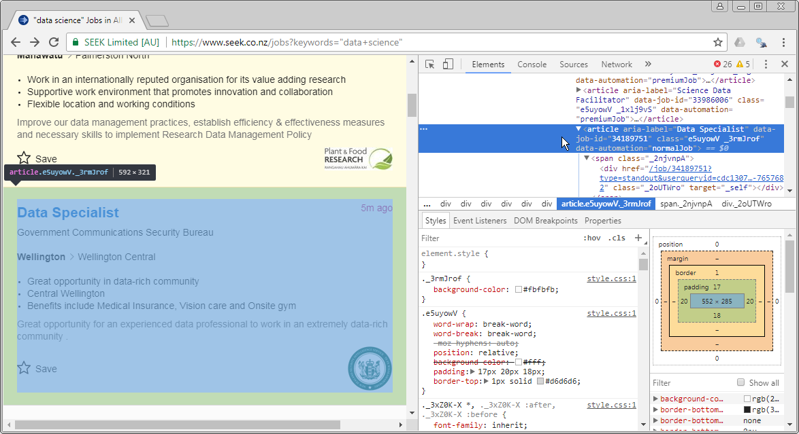
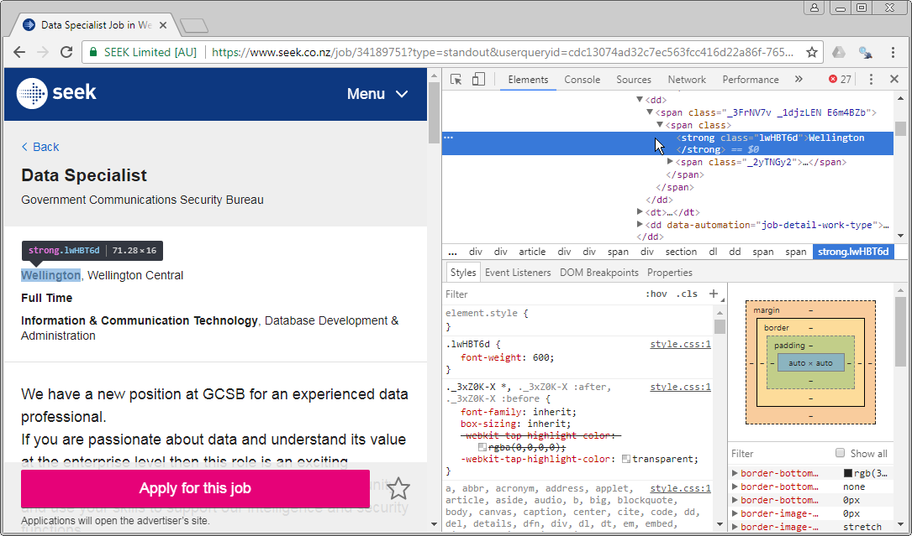

```{r setup, include=FALSE}
knitr::opts_chunk$set(echo = TRUE)
```
<span style="color: #ce2227">
**_If you have worked on this assignment in groups, then only a single submission is required from the group, but you should make a note of collaborators at the start of the document_**
</span>

# Group Members
- Ayesha Wan Ismail
- Bhavisha Solanki
- Ruth Banda

This assignment template should be considered a rough guide as an acceptable type of project for your first INFO 204 assignment. You can deviate from the actual process (e.g., scrape pages from two different web sites), but the main points to focus on are that:

  1. you provide a clear description of your problem that can be followed without any specific code; and
  2. your code matches the description of your workflow.
  
Your "analysis" following the data scraping does not need to be comprehensive (see below for how simple it may be). However, if you perform a more substantial analysis of your results, then this will be taken into account should you have missed anything earlier in your assignment and marks that you may have lost in earlier sections may be recovered.

# Problem Definition

Finding the most in-demand jobs around the world right now to see which countries/continents lack in which set of skill and also use this as a general guideline template for future students to look through in order to make relevant and practical study choices. Other question that we can ask would be is there a vast difference between countries and if there is a bias between the choices made by the population in these countries? 


To answer this question, we could follow this manual process:

  1. Visit the [Western Union] website and go to a blog article "[The Most In-Demand Careers Around the World]". 
  2. Underneath the main title, within sub-headings, we would see a list of jobs in-demand and the countries which are in short of them:
    a. Identify the jobs list (e.g. Teachers, Accountants) headings and countries in demand.
    b. Populate it into a vector.
    c. Add the identified location information to our list of results
    
  
## Required Components


On the "[The Most In-Demand Careers Around the World]" article, the page contains a list of jobs:


We know that the required URL to get the components from is https://www.westernunion.com/blog/jobs-in-demand/, and as we scroll down, we are able to identify the job titles headings, like below:



In the next section, we are going to scrape the job titles for the Western Union blog article. To do so, we must know how the page structures its documents and what hints can we extract from it to make it easier to identify the pages that we need. Also, we want to extract the 'Countries in Demand' section, so we also have to find the correct CSS selectors.

As we try to find the CSS selector for the 'Countries in Demand' section, we have to figure out how to exclude the paragraphs in CSS sections so that we scrape for Countries in Demand element, it would not get all of the irrelevant paragraphs (p) selectors.



So, once we are on the search results page, we can use the developer tools to explore the source behind the page, and from this, we can see that we need the article elements that have a data-automation attribute setting of 'normalJob':

Therefore, we can scrape the required job information with the XPath selector:
`"//article[@data-automation='normalJob']"`
Note that we haven't really talked about XPath in INFO 204 - it is an alternative to using CSS selectors that provide more fined-grained control over the access (but the syntax can sometimes be a little bit confusing, so use it only when absolutely necessary!). More details on XPath can be found [at this tutorial](https://www.w3schools.com/xml/xml_xpath.asp).

Similarly, we can use the developer tools to identify what part of these article elements contains the title and hyperlink. A little bit of drilling tells us that the title is an h1 (heading type 1) element, and there in an a (anchor) element under this with the link that we need. Therefore, once we have each of the article elements pertaining to the jobs, we can access the anchor element using the CSS selector:
`"h1 a"`, and then access the href attribute from this element to get to the next page.

The next page has a fairly simple structure that should be easily scraped:


Once the required element is identified, we can use the developer tools in Chrome to copy the required CSS selector, which is the awkward:
`"#app > div > div > div:nth-child(3) > div > div > div:nth-child(3) > div > div.PxPTnGA > div > article > div > div:nth-child(1) > span > div > section > dl > dd:nth-child(4) > span > span > strong"`.
With a bit of tweaking, we can make this selector somewhat less awkward:
`"dl > dd:nth-child(4) > span > span > strong"`.

With the XPath/CSS selectors identified, and a general workflow in place, we can now proceed with the scraping.

# Scraping Procedure
We start with defining a few key components (the required libraries, starting url, and key XPath/CSS selectors):

```{r get job titles, echo=TRUE}
library(rvest)

blog.url <- "https://www.westernunion.com/blog/jobs-in-demand/"
doc.url <- read_html(blog.url)

list.jobtitles <- html_nodes(doc.url, "#main > div.row.row-flex.post-single > div > div > div.row.post-data > div > div.post-content > h2")
html_text(list.jobtitles)
```

```{r get countries in demand, echo=TRUE}
blog.url <- "https://www.westernunion.com/blog/jobs-in-demand/"
doc.url <- read_html(blog.url)

list.countries <- html_nodes(doc.url, "#main > div.row.row-flex.post-single > div > div > div.row.post-data > div > div.post-content > p")
html_text(list.countries)
```

We start with defining a few key components (the required libraries, starting url, and key XPath/CSS selectors):
```{r scraping setup, echo=TRUE}
library(rvest)

search.url <- "https://www.seek.co.nz/jobs?keywords=%22data+science%22"
job.selector <- "//article[@data-automation='normalJob']" ## note: XPath selector!
title.selector <- "h1 a"
```

As, we're going to be scraping multiple pages, and the source links will be scraped from our start document, we will need to use a session to keep track of the relevant details:
```{r session, echo=TRUE}
doc <- html_session(search.url)
```

And now, we should retrieve our required list of advertised jobs:
```{r fetch jobs, echo=TRUE}
jobs <- html_nodes(doc, xpath=job.selector)
cat("Fetched", length(jobs), "results\n")
```
note that we used the `xpath` parameter of the `html_nodes()` function instead of using a normal CSS selector. This was due to the selection of by attribute status, which cannot be easily done using a CSS selector.

Having found the `r length(jobs)` jobs, we need to extract the required hyperlinks that lead us to the job description pages:
```{r fetch urls, echo=TRUE}
job.links <- html_nodes(jobs, title.selector)
job.href <- html_attr(job.links, "href")
```

Now, we perform the iteration over the href attributes that we discovered, extract the relevant page elements, and add them into a results list (steps 2 a, b, and c in our previously defined workflow):
```{r scraper iteration, echo=TRUE}
location.selector <- "dl > dd:nth-child(4) > span > span > strong"
job.locations <- NULL ## a container for our results, starts off empty
for (job in job.href) {
  job.loc <- tryCatch({
    job.doc <- jump_to(doc, job)
    job.loc <- html_node(job.doc, location.selector)
    
    html_text(job.loc)
  }, error=function(e) NULL)

  ## add the next location to our results vector
  job.locations <- c(job.locations, job.loc)
}
job.locations
```
Note the use of the `tryCatch()` function here - this is to handle any cases where following a link may produce an error (e.g., a 404 error for a broken link referring to a missing page).

# Analysis
Our `job.locations` vector is now complete, and should contain an entry for every job advertised. Now, we can create a tally of these locations and plot them using a suitable method (e.g., a bar plot):
```{r summary, echo=TRUE, fig.align="center", out.width="100%"}
tally <- table(job.locations)
barplot(tally, main="Location of Data Science Jobs on Seek", ylab="# Jobs Found", col="#00508f")
```

The analysis done here suggests that the majority of data science jobs are in the North Island and centred around either Auckland or Wellington.

## Assumptions
The analysis here is rather simple - we have only really considered a single search for jobs on a single web site. To be more rigorous, we should examine multiple web sites, and maybe attempt to consider other terms often confused with or related to "data science" (e.g., "predictive analytics", "data mining", "machine learning").

[Seek]: https://seek.co.nz
[query results]: https://www.seek.co.nz/jobs?keywords=%22data+science%22
[Western Union]: https://www.westernunion.com/
[The Most In-Demand Careers Around the World]: https://www.westernunion.com/blog/jobs-in-demand/


