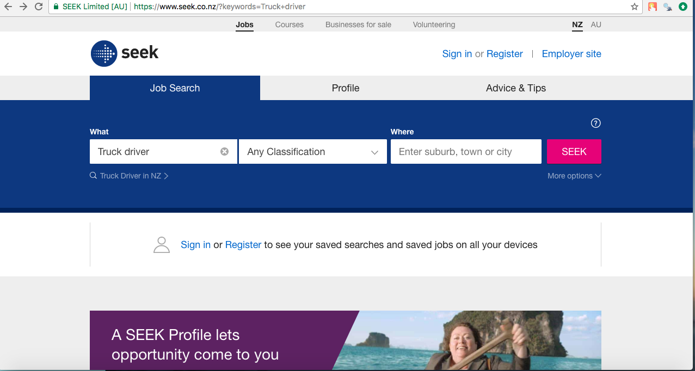
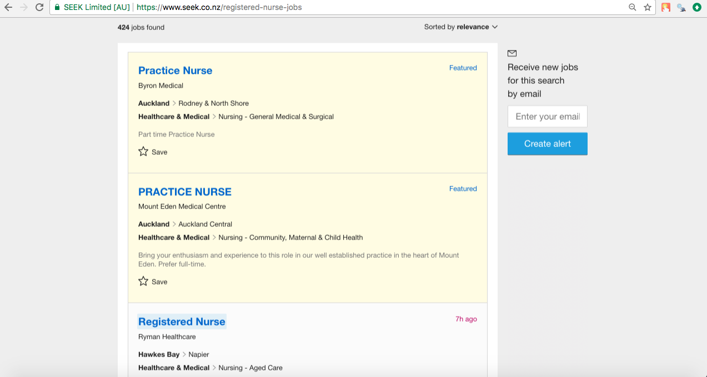

```{r setup, include=FALSE}
knitr::opts_chunk$set(echo = TRUE)
```
<span style="color: #ce2227">
**_If you have worked on this assignment in groups, then only a single submission is required from the group, but you should make a note of collaborators at the start of the document_**
</span>

# Group Members
- Ayesha Wan Ismail
- Bhavisha Solanki
- Ruth Banda

This assignment template should be considered a rough guide as an acceptable type of project for your first INFO 204 assignment. You can deviate from the actual process (e.g., scrape pages from two different web sites), but the main points to focus on are that:

  1. you provide a clear description of your problem that can be followed without any specific code; and
  2. your code matches the description of your workflow.
  
Your "analysis" following the data scraping does not need to be comprehensive (see below for how simple it may be). However, if you perform a more substantial analysis of your results, then this will be taken into account should you have missed anything earlier in your assignment and marks that you may have lost in earlier sections may be recovered.

# Problem Definition

Finding the top 9 most in-demand careers of 2017 and the salary that you receive from working under one of those job category. We will then compare it to see when typed into Seek to search for jobs in New Zealand of those 9 categories how many jobs of them are available in our country and in what city/area. This is for us to compare if the careers are more in demand because it is a low pay job or if it because the country lacks that set of skills and knowledge level or it could just be a mixture of both. Also for the next generation to take into account in deciding careers and what job paths they want to take. So they can understand what jobs are in demand and what is the strong growing field also to know what lacks skills and to work towards gaining more skills and experience for jobs rather than sticking to low pay jobs however that can be a starting point for them when entering into the industry and earning in their initial years and from their can move up and into higher positions.

To answer this question, we could follow this manual process:

  1. Visit the [Seek] website and go search below specific jobs and where they are available in New Zealand. 
  2. Underneath the main title, within sub-headings, we would see the space to type in our specified job and click the seek button to see where it is available in the country and how many of that job is available (e.g 50 jobs or 200)
    a. Identify the jobs list (e.g. Truck Drivers, Registered Nurses) headings and city that requires it as well as show the total number of jobs found at the top when searched.
    b. Populate it into a vector.
    c. Add the identified location information to our list of results
    
  
## Required Components


On the "[Seek]" page, under the hob search heading you can search for a particular job and where it is placed:



We know that the required URL to get the components from is https://www.seek.co.nz/, and as we scroll down, we are able to identify different headings and sub headings and a search button, like below:


In the next section, we are going to scrape the information below on the seek page after we have clicked the seek button. To do so, we must know how the page structures its documents and what hints can we extract from it to make it easier to identify the pages that we need. Also, we want to extract the number of jobs found  section, so we also have to find the correct CSS selectors. It is very important to use the top left hand corner highlighted showing the number of jobs found so we know how many the country has or lacks of that specific job category and skills related to that. The reason also why they may not take it which may be due to salary which the next website we scrape will compare.

As we try to find the CSS selector for the number of jobs found for the particular jobs searched, we have to figure out how to exclude the paragraphs in CSS sections so that we scrape for number of jobs element under each job heading which is related to the next webpage we will scrape which is the 9 most in demand jobs, it would not get all of the irrelevant paragraphs (p) selectors.


)

We want to take the job heading and the location it is at the other details are not necessary just the job title and where in the country it is located so can be used to make our graphs. 


Image for first website for x path for seek for truck driver (u add it in)

We are using Chrome Developer tools to get the XPath of the number of jobs available for the specific job searched in the seek section in the website. We do this to get the raw data to plot the number of jobs in each category to what that jobs salary provides and the location of the job in the country (e.g south island or north island). This data will aid us in plotting our graphs and to find trends within jobs (y-axis: jobs category and the number available, x-axis: salary of each of the 9 job categories (we get this data fromt he next website we extract)). 


1. Visit the [CNBC] website and go to a blog article "[The 9 most-in-demand jobs of 2017]". 
  2. Underneath the main title, within sub-headings, we would see a list of jobs in-demand, their current salary and the projected hiring growth of that job by 2024:
    a. Identify the 9 jobs in demand (e.g. Registered Nurse, Data Scientist) and projected hiring growth by 2024.
    b. Populate it into a table.
    c. Add the identified location information to our list of results
 
 On the "[The 9 Most In-Demand Jobs of 2017]" article, the page contains a list of jobs:

   
    
We know that the required URL to get the components from is https://www.cnbc.com/2017/03/27/the-9-most-in-demand-jobs-of-2017.html, and as we scroll down, we are able to identify the job titles headings and sub headings. In this section, we are going to scrape the job titles and salary title to compare with the seek website. To do so, we must know how the page structures its documents and what hints can we extract from it to make it easier to identify the pages that we need. Also, we want to extract the 'Salary' section and the "Job title section" with its given rank, so we also have to find the correct CSS selectors. like below:

    


 code image for 2nd website (with the code) change description below
As we try to find the CSS selector for the '9 most in demand careers' section, we have to figure out how to exclude the paragraphs in CSS sections so that we scrape for projected growth, it would not get all of the irrelevant paragraphs (p) selectors.

![The parts of the 9 most in demand careers that we need to scrape (compact interface shown)]
We want to take the 9 careers which are mentioned and the salary of each job which is an estomate of how much each individual earns doing those top 9 most in demand careers. This will show us if there is a relatonship between salary and most in demand careers such as they are in demand as they are a low pay or there is a lack of skills and knowledge around that area in our country. The data is only reliable to New Zealand as we are using a NZ job site therefore is limited to one country which means will be more reliable but can not be assumed for multiple countries and populations.


<!-- So, once we are on the search results page, we can use the developer tools to explore the source behind the page, and from this, we can see that we need the article elements that have a data-automation attribute setting of 'normalJob': -->
<!--  -->
<!-- Therefore, we can scrape the required job information with the XPath selector: -->
<!-- `"//article[@data-automation='normalJob']"` -->
<!-- Note that we haven't really talked about XPath in INFO 204 - it is an alternative to using CSS selectors that provide more fined-grained control over the access (but the syntax can sometimes be a little bit confusing, so use it only when absolutely necessary!). More details on XPath can be found [at this tutorial](https://www.w3schools.com/xml/xml_xpath.asp). -->

<!-- Similarly, we can use the developer tools to identify what part of these article elements contains the title and hyperlink. A little bit of drilling tells us that the title is an h1 (heading type 1) element, and there in an a (anchor) element under this with the link that we need. Therefore, once we have each of the article elements pertaining to the jobs, we can access the anchor element using the CSS selector: -->
<!-- `"h1 a"`, and then access the href attribute from this element to get to the next page. -->

<!-- The next page has a fairly simple structure that should be easily scraped: -->

<!--  -->
<!-- Once the required element is identified, we can use the developer tools in Chrome to copy the required CSS selector, which is the awkward: -->
<!-- `"#app > div > div > div:nth-child(3) > div > div > div:nth-child(3) > div > div.PxPTnGA > div > article > div > div:nth-child(1) > span > div > section > dl > dd:nth-child(4) > span > span > strong"`. -->
<!-- With a bit of tweaking, we can make this selector somewhat less awkward: -->
<!-- `"dl > dd:nth-child(4) > span > span > strong"`. -->

<!-- With the XPath/CSS selectors identified, and a general workflow in place, we can now proceed with the scraping. -->

# Scraping Procedure
We start with defining a few key components (the required libraries, starting url, and key XPath/CSS selectors):

```{r get job titles, echo=TRUE}
library(rvest)

blog.url <- "https://www.westernunion.com/blog/jobs-in-demand/"
doc.url <- read_html(blog.url)

list.jobtitles <- html_nodes(doc.url, "#main > div.row.row-flex.post-single > div > div > div.row.post-data > div > div.post-content > h2")
raw.data <- html_text(list.jobtitles)
clean.jobtitles.data <- gsub("[\n]", "", raw.data)
clean.jobtitles.data
```

However for the second part, we have to exclude other paragraphs. 
```{r get countries in demand, echo=TRUE}
countries.selector <- "//*[@id='main']/div[2]/div/div/div[2]/div/div[3]/p[5]"
list.paragraphs <- html_nodes(doc.url, xpath=countries.selector)
raw.paragraphs.data <- html_text(list.paragraphs)
raw.paragraphs.data
```


However for the second part, we have to exclude other paragraphs. We have to perform the iteration over the href attributes that we discovered, extract the relevant page elements, and add them into a results list (steps 2 a, b, and c in our previously defined workflow). :
```{r get countries in a for loop, echo=TRUE}
countries.selector <- "//*[@id='main']/div[2]/div/div/div[2]/div/div[3]/p[9]"
list.paragraphs <- html_nodes(doc.url, xpath=countries.selector)
raw.paragraphs.data <- html_text(list.paragraphs)
raw.paragraphs.data

```


We start with defining a few key components (the required libraries, starting url, and key XPath/CSS selectors):
```{r scraping setup, echo=TRUE}
library(rvest)

search.url <- "https://www.seek.co.nz/jobs?keywords=%22data+science%22"
job.selector <- "//article[@data-automation='normalJob']" ## note: XPath selector!
title.selector <- "h1 a"
```

As, we're going to be scraping multiple pages, and the source links will be scraped from our start document, we will need to use a session to keep track of the relevant details:
```{r session, echo=TRUE}
doc <- html_session(search.url)
```

And now, we should retrieve our required list of advertised jobs:
```{r fetch jobs, echo=TRUE}
jobs <- html_nodes(doc, xpath=job.selector)
cat("Fetched", length(jobs), "results\n")
```
note that we used the `xpath` parameter of the `html_nodes()` function instead of using a normal CSS selector. This was due to the selection of by attribute status, which cannot be easily done using a CSS selector.

Having found the `r length(jobs)` jobs, we need to extract the required hyperlinks that lead us to the job description pages:
```{r fetch urls, echo=TRUE}
job.links <- html_nodes(jobs, title.selector)
job.href <- html_attr(job.links, "href")
```

Now, we perform the iteration over the href attributes that we discovered, extract the relevant page elements, and add them into a results list (steps 2 a, b, and c in our previously defined workflow).
```{r scraper iteration, echo=TRUE}
location.selector <- "dl > dd:nth-child(4) > span > span > strong"
job.locations <- NULL ## a container for our results, starts off empty
for (job in job.href) {
  job.loc <- tryCatch({
    job.doc <- jump_to(doc, job)
    job.loc <- html_node(job.doc, location.selector)
    
    html_text(job.loc)
  }, error=function(e) NULL)

  ## add the next location to our results vector
  job.locations <- c(job.locations, job.loc)
}
job.locations
```
Note the use of the `tryCatch()` function here - this is to handle any cases where following a link may produce an error (e.g., a 404 error for a broken link referring to a missing page).

# Analysis
Our `job.locations` vector is now complete, and should contain an entry for every job advertised. Now, we can create a tally of these locations and plot them using a suitable method (e.g., a bar plot):
```{r summary, echo=TRUE, fig.align="center", out.width="100%"}
tally <- table(job.locations)
barplot(tally, main="Location of Data Science Jobs on Seek", ylab="# Jobs Found", col="#00508f")
```

The analysis done here suggests that the majority of data science jobs are in the North Island and centred around either Auckland or Wellington.

## Assumptions
The analysis here is rather simple - we have only really considered a single search for jobs on a single web site. To be more rigorous, we should examine multiple web sites, and maybe attempt to consider other terms often confused with or related to "data science" (e.g., "predictive analytics", "data mining", "machine learning").

[Seek]: https://seek.co.nz
[query results]: https://www.seek.co.nz/jobs?keywords=%22data+science%22
[Western Union]: https://www.westernunion.com/
[The Most In-Demand Careers Around the World]: https://www.westernunion.com/blog/jobs-in-demand/


